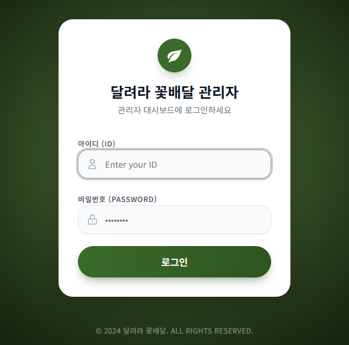
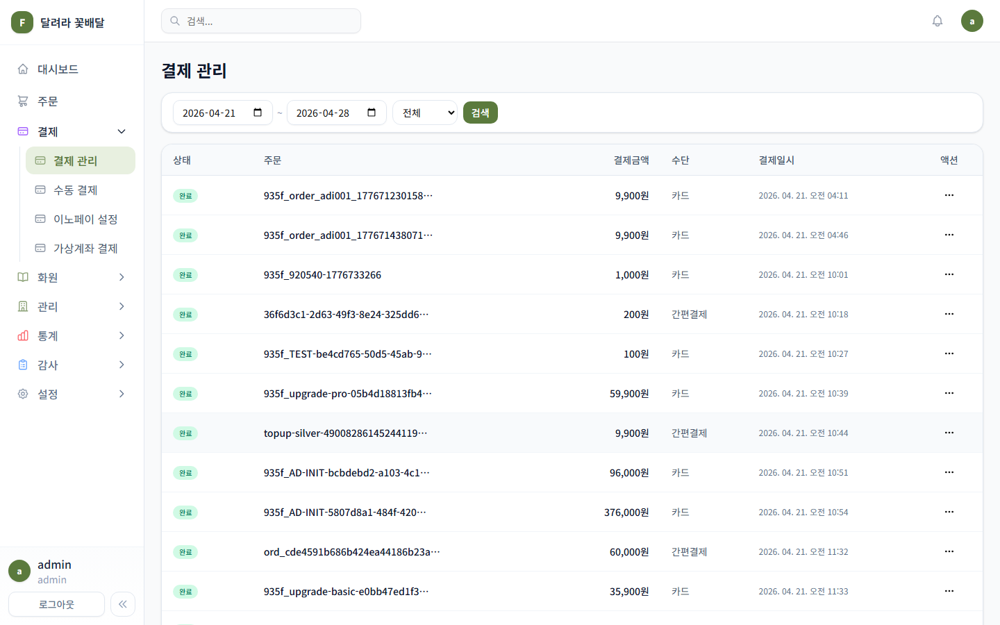
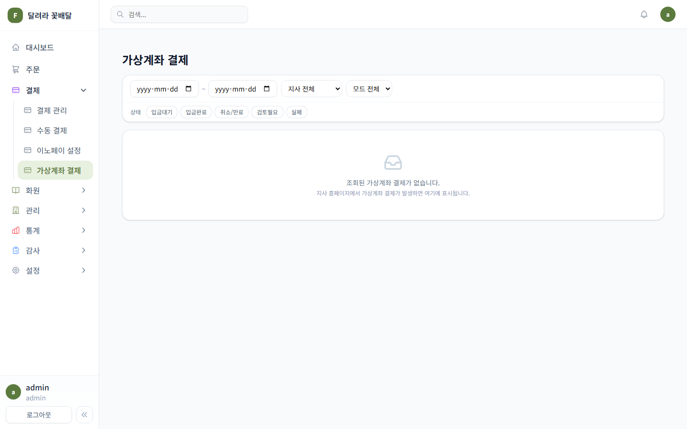
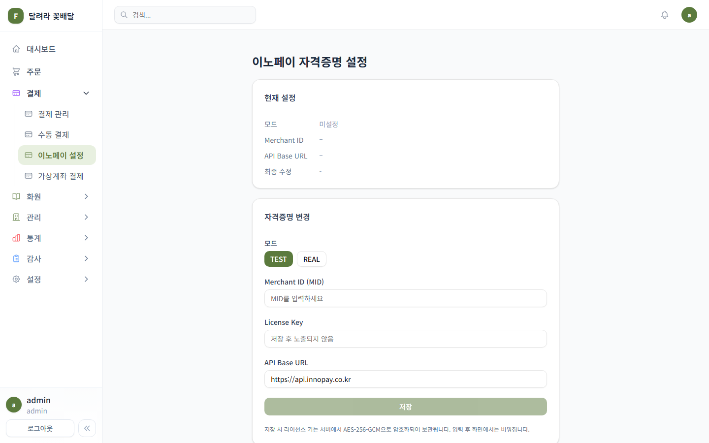
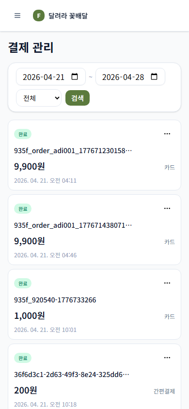

# RunFlower Admin Design Brainstorm

Date: 2026-05-06

## TL;DR

현재 관리자 UI는 기능 범위가 넓고 기본 구조도 갖춰져 있지만, 운영자가 매일 반복해서 쓰는 화면 기준으로는 “상태 우선순위”와 “다음 행동”이 약하게 보입니다. 결제/가상계좌/화원/주문처럼 사건 단위로 처리해야 하는 화면은 단순한 카드와 테이블을 넘어, **운영 큐 + 상태 레일 + 저장된 뷰 + 우측 상세 패널** 패턴으로 정리하는 것이 가장 효과적입니다.

추천 방향은 새 콘셉트를 크게 바꾸는 것이 아니라 다음 네 가지입니다.

1. 결제/주문/화원 목록을 “목록”이 아니라 “처리 큐”로 보이게 만든다.
2. 필터를 매번 조립하는 방식에서 “운영자가 자주 쓰는 저장된 뷰”로 전환한다.
3. 상세 확인은 모달보다 우측 패널을 기본으로 해서 목록 문맥을 유지한다.
4. 모바일은 데스크톱 축소판이 아니라 “오늘 처리할 항목 카드” 중심으로 분리한다.

## Current State

*현재 로그인 화면. 브랜드 색은 명확하지만, 운영 백오피스치고는 카드 반경, 그라데이션, 그림자 표현이 다소 마케팅 화면에 가깝다.*

*결제 관리 데스크톱. 사이드바와 테이블 기반의 전형적인 백오피스 구조이며, 조회 조건은 상단 카드에 묶여 있다.*

*가상계좌 결제. 필터와 상태 칩은 있으나, 운영자가 어떤 상태를 먼저 봐야 하는지의 우선순위가 약하다.*

*이노페이 자격증명 설정. 설정 자체는 단순하지만, 운영 환경 위험도와 최근 변경 이력이 화면 위계에 충분히 드러나지 않는다.*

*모바일 결제 관리. 테이블을 카드로 바꾼 점은 적절하지만, 액션과 상태 판단 정보가 분산되어 있다.*

## Product Reading

RunFlower 관리자 앱은 일반 SaaS 대시보드보다 “주문/결제/화원/정산을 놓치지 않는 운영 콘솔”에 가깝습니다. 사용자는 새 정보를 감상하는 사람이 아니라, 오늘 들어온 결제와 예외를 빠르게 확인하고 다음 조치를 취하는 운영자입니다.

현재 강점:

- 좌측 내비게이션의 큰 정보 구조는 이미 운영 도메인별로 나뉘어 있다.
- 결제 관리 화면은 데스크톱 테이블과 모바일 카드의 분기 방향이 맞다.
- 결제 상태 칩, 날짜 필터, 가상계좌 탭처럼 업무에 필요한 기본 요소가 있다.
- 녹색 브랜드 컬러가 일관되게 쓰여 서비스 정체성은 유지된다.

현재 약점:

- 화면이 “데이터를 보여주는 상태”에 머물고 “무엇부터 처리할지”를 강하게 안내하지 않는다.
- 결제 관리, 가상계좌 운영 로그, 이노페이 설정이 같은 중요도로 보이며 위험도 차이가 잘 드러나지 않는다.
- 상단 검색창과 페이지별 필터가 분리되어 있어 전역 검색인지 현재 목록 검색인지 애매하다.
- 사이드바 메뉴가 기능 수 증가를 그대로 반영해, 빈번한 업무와 드문 설정 업무의 시각적 차이가 약하다.
- 모바일 카드는 보기에는 안정적이지만, 처리 액션을 빠르게 끝내는 구조라기보다는 읽기용 카드에 가깝다.

## Baseline Pattern

꽃배달/주문/결제 운영툴의 당연한 접근은 다음과 같습니다.

- 좌측 사이드바
- 상단 검색
- 필터 카드
- 상태 칩
- 테이블 목록
- 행별 더보기 메뉴
- 상세 모달

현재 RunFlower도 이 베이스라인에 가깝습니다. 안정적이지만, 경쟁력 있는 운영 경험으로 가려면 단순 CRUD 화면보다 “업무 흐름을 줄이는 구조”가 필요합니다.

## Cross-Pollinated Ideas

### 1. Linear Inbox Pattern: 결제/주문을 처리 큐로 재정의

Linear의 Inbox/Triage는 단순 목록이 아니라 “처리해야 할 이벤트 큐”로 작동합니다. 빠른 검색, 읽음/미룸, 우측 상세, 키보드 이동 같은 패턴이 핵심입니다. RunFlower의 결제 실패, 입금대기, 검토필요, 신규 화원 등록도 같은 방식으로 다룰 수 있습니다.

적용안:

- `/admin/payments/vbank`의 기본 탭을 단순 `문제`가 아니라 `처리 필요`로 명명한다.
- 항목별로 `검토 필요`, `입금 지연`, `자동 매칭 실패`, `설정 확인` 같은 운영 원인을 한 줄로 보여준다.
- 목록에서 클릭하면 모달 대신 우측 상세 패널을 열어, 목록 위치와 필터 상태를 유지한다.
- `확인`, `보류`, `해결`, `다시 조회` 같은 액션을 행 또는 패널 상단에 고정한다.

효과:

- 운영자가 “어떤 행을 눌러봐야 하나”를 판단하는 시간을 줄인다.
- 빈 화면도 “문제 없음”이라는 운영 신호로 바뀐다.

Reference: Linear Inbox supports notification filtering, quick search, list actions, snooze/reminder flows, and keyboard movement.

### 2. Shopify Orders Pattern: 저장된 뷰와 업무별 필터

Shopify Admin의 Orders는 검색, 결제/배송/태그/날짜 필터, 저장된 필터 조합을 중심으로 주문 운영을 줄입니다. RunFlower 결제 관리도 현재는 날짜 + 상태만 보이지만, 실제 운영자는 “오늘 입금대기”, “검토필요”, “고액 결제”, “지사별 결제”, “카드/가상계좌 분리” 같은 관점을 반복해서 쓸 가능성이 높습니다.

적용안:

- 결제 관리 상단에 `전체`, `오늘 완료`, `입금대기`, `검토필요`, `고액`, `가상계좌` 같은 저장된 뷰 탭을 둔다.
- 날짜 입력은 기본 접어두고, 저장된 뷰 아래에서 필요할 때만 확장한다.
- 필터 적용 후에는 현재 조건을 칩으로 노출하고 `초기화`를 함께 둔다.
- 검색 버튼 의존도를 낮추고, 조건 변경 후 자동 조회 또는 명확한 `적용` 패턴으로 통일한다.

효과:

- 매일 같은 필터를 반복 조작하는 시간을 줄인다.
- 신규 운영자도 어떤 관점으로 봐야 하는지 화면에서 배운다.

Reference: Shopify documents order search, fulfillment/payment/date/tag filters, and saved filter combinations for recurring order views.

### 3. Stripe Dashboard Pattern: 결제 운영 화면에 위험도와 내보내기 축 추가

Stripe Dashboard는 결제, 잔액, 고객, 리포팅, Workbench처럼 결제 운영에 필요한 축을 명확히 나눕니다. 특히 결제 리스트는 필터와 export, 오류/웹훅 로그 같은 운영 확인 경로가 연결되어 있습니다.

적용안:

- 결제 관리 테이블 상단에 요약 바를 추가한다: `완료 금액`, `입금대기`, `검토필요`, `취소/실패`, `최근 갱신`.
- 가상계좌 운영 로그의 `문제`, `타임라인`, `결제`, `계좌풀` 탭 위에 “현재 리스크” 요약을 둔다.
- CSV/Excel 내보내기가 있다면 테이블 액션으로 노출하고, 없다면 명시적으로 우선순위에서 제외한다.
- 설정 화면에는 `TEST/REAL`, 마지막 변경자, 마지막 검증 시각, API 연결 상태를 첫 카드에 배치한다.

효과:

- 결제 화면이 단순 조회에서 재무/운영 모니터링 화면으로 격상된다.
- 운영 환경 설정의 위험도를 더 빨리 인지할 수 있다.

Reference: Stripe Dashboard organizes primary navigation around balances, transactions, customers, reporting, and integration monitoring; payments can be filtered or exported.

### 4. Notion/Airtable Database Pattern: 컬럼 가시성과 상세 보기 제어

RunFlower 테이블은 결제키, 주문명, 결제금액, 수단, 일시, 액션을 고정적으로 보여줍니다. 운영자 역할별로 필요한 컬럼은 달라질 수 있습니다. Notion/Airtable식의 “뷰별 컬럼 구성”을 가볍게 도입하면 과한 설정 화면 없이도 밀도를 조절할 수 있습니다.

적용안:

- 결제 관리에 `표시 항목` 메뉴를 추가해 `주문명`, `지사`, `고객명`, `결제수단`, `상태`, `처리자`를 켜고 끄게 한다.
- 기본 뷰는 과감히 줄인다: 상태, 주문/고객, 금액, 수단, 일시, 액션.
- 긴 orderId는 첫 화면에서는 보조 정보로 내리고, hover/click 상세에서 전체 값을 보여준다.
- 넓은 테이블에서는 첫 컬럼을 고정하거나, 모바일에서는 동일 정보를 카드의 상단/하단 슬롯으로 재배치한다.

효과:

- 정보량은 유지하면서 첫 화면의 인지 부담을 낮춘다.
- 역할별 운영 화면을 새로 만들지 않고도 밀도를 조절할 수 있다.

Reference: Notion database views support filters, sorts, groups, and property visibility/freeze patterns for large data views.

### 5. Dispatch Board Pattern: 화원/주문은 지도보다 “지역 레인”이 먼저

꽃배달 운영은 지리 정보가 중요하지만, 항상 지도부터 필요한 것은 아닙니다. 배차/물류 도구의 레인 구조처럼 지역, 배송시간, 처리 상태를 가로 레인으로 보여주면 운영자가 병목을 빨리 찾을 수 있습니다.

적용안:

- 주문 화면에 `오늘 배송`, `미배정`, `배송 임박`, `완료`, `취소/문제` 레인을 둔다.
- 화원 목록에는 `지역`, `추천`, `활성`, `사진 부족`, `최근 주문 없음` 같은 운영 필터를 저장된 뷰로 둔다.
- 지도는 별도 페이지가 아니라 특정 주문 또는 지역 필터에서 보조 패널로 연다.

효과:

- 주문/화원 운영 화면이 검색 중심에서 배정/처리 중심으로 바뀐다.
- 꽃배달 도메인 특성이 UI에 더 직접적으로 드러난다.

## Concrete Screen Changes

### Admin Shell

- 사이드바 상위 메뉴는 유지하되, `결제`, `주문`, `화원`을 “일일 운영” 영역으로 묶고 `설정`, `감사`, `백업`은 하단 보조 영역으로 낮춘다.
- 전역 검색창에는 placeholder를 `주문번호, 고객명, 화원명 검색`처럼 실제 검색 범위로 바꾼다.
- 현재 페이지 전용 검색과 전역 검색이 혼동되지 않도록, 페이지 내부 검색은 테이블 툴바 안에 둔다.

### Login

- 카드 반경을 `rounded-3xl`에서 운영툴에 맞는 12px 전후로 낮춘다.
- 배경 그라데이션은 유지하되 대비를 약하게 해서 로그인 폼이 더 선명하게 보이게 한다.
- `Enter your ID`, `PASSWORD` 같은 영어 보조 문구는 한국어 운영툴 톤에 맞게 정리한다.

### Payments

- 필터 카드는 테이블 위 툴바로 낮추고, 저장된 뷰 탭을 먼저 보여준다.
- 테이블 첫 열은 상태만 두지 말고 상태 + 처리 이유를 함께 보여준다.
- `...` 액션은 자주 쓰는 1차 액션을 노출하고, 드문 액션만 메뉴로 넣는다.
- 금액 컬럼은 현재처럼 강하게 유지하되, 고액/실패/취소는 색이 아니라 아이콘+텍스트로 의미를 명확히 한다.

### VBank Operations

- `문제`, `타임라인`, `결제`, `계좌풀` 탭 앞에 요약 카드 3개만 둔다: `처리 필요`, `입금대기`, `계좌풀 잔량`.
- 빈 상태는 큰 빈 카드보다 작고 명확한 정상 상태 표시로 바꾼다.
- 상세는 우측 패널로 열고, 원본 이벤트/결제/계좌 정보를 탭으로 나눠 한 화면에서 추적한다.

### Credentials

- `현재 설정` 카드에 `운영 모드`, `마지막 검증`, `마지막 수정자`, `연결 상태`를 추가한다.
- TEST/REAL 토글은 저장 버튼 가까이가 아니라 카드 상단의 환경 배지와 연결한다.
- 저장 버튼은 비활성 녹색처럼 보이지 않도록 enabled/disabled 상태를 명확히 분리한다.

### Mobile

- 결제 카드는 `상태`, `금액`, `주문/고객`, `일시`, `수단`, `주 액션` 순서로 고정한다.
- 카드 우상단 `...`만 두지 말고, 검토필요/입금대기 상태에서는 `상세`, `확인`을 바로 노출한다.
- 날짜 필터는 두 줄 입력보다 `오늘`, `7일`, `이번 달`, `직접 선택` 세그먼트가 먼저다.

## Suggested Design Direction

톤:

- 운영툴: 밝은 배경, 낮은 그림자, 8-12px 반경, 강한 텍스트 대비.
- 브랜드: 녹색은 주요 액션과 활성 상태에만 사용하고, 상태 색은 의미별로 분리.
- 밀도: 카드 남발보다 테이블/리스트 중심. 단, 모바일은 처리 카드 중심.

컴포넌트:

- Saved view tabs
- Persistent filter chips
- Right detail drawer
- Status reason chips
- Operational summary strip
- Column visibility menu
- Inline row action buttons

우선순위:

1. 결제 관리의 저장된 뷰 + 상태 이유 + 우측 상세 패널
2. 가상계좌 운영 로그의 처리 큐화
3. 사이드바 정보 구조 정리
4. 로그인/설정 화면의 운영툴 톤 조정
5. 모바일 결제 카드 액션 강화

## Sources

- Stripe Dashboard basics: https://docs.stripe.com/dashboard/basics
- Shopify order viewing and filtering: https://help.shopify.com/en/manual/fulfillment/managing-orders/viewing-orders
- Linear Inbox docs: https://linear.app/docs/inbox
- Notion views, filters, sorts, groups: https://www.notion.com/en-gb/help/views-filters-and-sorts

